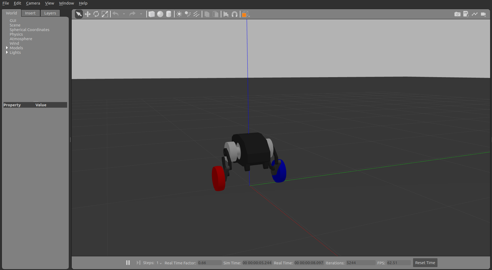

# diablo_ros1

ROS1 + Gazebo simulation for Diablo balance bot.
run

    roslaunch diablo_simulation gazebo.launch

to start the simulation. 

Accepts **geometry_msgs/Twist** commands at topic ***diablo/vel_cmd***

**linear.x** for forward/backward velocity

**linear.z** between (-0.5, +0.5) to adjust height

**angular.x** between (-0.5, +0.5) to adjust roll angle

**angular.z** for turning velocity

**linear.y** if above **1**, commands the vehicle to perform one jump
